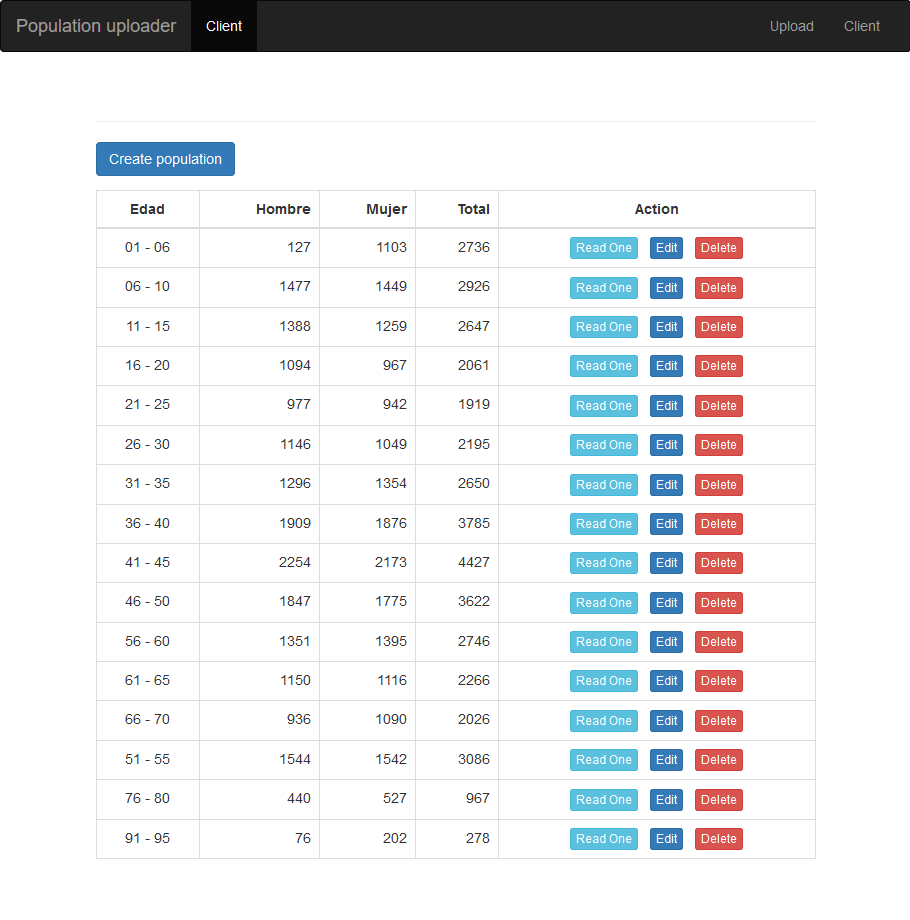

# Population CSV uploader and CRUD

Population by age and sex CSV uploader

Only use GET methods, to be able to test the CRUD more easily.

## Demo data 

Demo data from https://datos.gob.es

Location: /demo_data/poblacion-espanola.csv

## Uploader

- Install with `npm install`

- Start with `npm run start`

- Dependences:

    `"express": "^4.16.4",
    "express-fileupload": "^1.0.0",
    "fast-csv": "^2.4.1",
    "json2csv": "^4.3.2",
    "mongoose": "^5.4.0"`

http://localhost:3000

## CRUD REACT CLIENT

- Go to client folder `cd .\public\client\`
- Install with `npm install`

http://localhost:3000/public/client/

- Dependences:

    `"react": "^15.6.1",
    "react-dom": "^15.6.1"`

## Schema for CSV AND MODEL

    Edad:String,
    Hombre:Number
    Mujer:Number
    Total:Numbe

## CRUD API GETS

### SHOW ALL 
http://localhost:3000/api/population/all

### GET ONE
`http://localhost:3000/api/population/[ObjectId]`

http://localhost:3000/api/population/5ca22fcb080e9006a011da3c

### INSERT
`http://localhost:3000/api/population/add/[Edad]/[Hombre]/[Mujer]/[Total]`

http://localhost:3000/api/population/add/Viejo/10/10/20

### UPDATE
`http://localhost:3000/api/population/edit/[ObjectId]/[Edad]/[Hombre]/[Mujer]/[Total]`

http://localhost:3000/api/population/edit/5ca22f84488dbd0a20c9b57b/Viejo2/11/11/22

### DELETE
`http://localhost:3000/api/population/delete/[ObjectId]`

http://localhost:3000/api/population/delete/[5ca22f84488dbd0a20c9b57b]